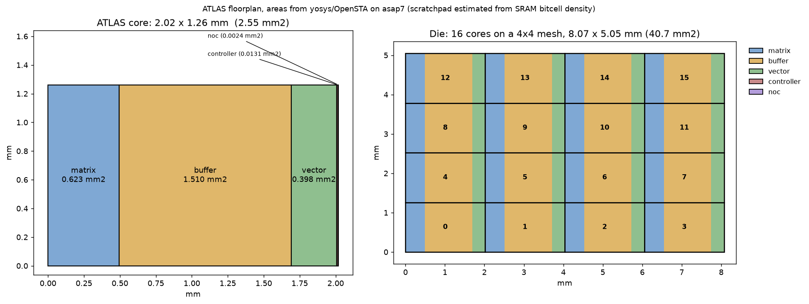

# ATLAS RTL: FP4/FP8 inference on hybrid-bonding DRAM

A synthesisable SystemVerilog implementation of the ATLAS accelerator, with a
low-precision (MXFP4 / FP8) datapath sized for Qwen3-235B-A22B inference, the
HBDRAM memory system it is built around, and an open-source synthesis and
static-timing flow that measures it.

The architecture follows the ATLAS simulator in this repository. Numbers that
describe the machine — 7680 MACs and 480 vector lanes per core, a 4 MB
scratchpad, a 4×4 mesh, 16 HBDRAM channels at 1024 bits and 500 MT/s — are read
from `configs/architecture/chip/cloud/stratum/atlas.yaml`,
`configs/architecture/dram/cloud/cloud_1TBps.yaml`, and the HBDRAM device model
in `patches/ramulator2.patch`. Model dimensions come from
`configs/models/qwen3_235b_a22b.json`.

---

## 1. What is here

```
rtl/include/atlas_defs.svh     formats, chip and HBDRAM parameters
rtl/fp/                        the low-precision numeric datapath
rtl/core/                      PE, matrix engine, vector engine, scratchpad,
                               transcendentals, RMSNorm
rtl/mem/                       HBDRAM controller, DMA, arbitration
rtl/moe/                       Qwen3 top-8-of-128 expert router
rtl/noc/                       mesh router and network
rtl/top/                       core and chip integration
rtl/gen/                       generated lookup tables (do not edit)

tb/golden/                     Python reference model and stimulus generators
tb/sv/                         self-checking testbenches
tb/run_all.sh                  run the whole regression

syn/run_synth.sh               yosys synthesis to ASAP7 or sky130
syn/run_all.sh                 synthesise and time every block
sta/run_sta.sh                 OpenSTA timing, power and design-rule checks
sta/run_fmax.sh                frequency sweep (re-synthesises per target)
pd/build_floorplan.py          area roll-up and chip floorplan
```

---

## 2. The numeric datapath

### 2.1 The multiplier array is integer, not floating point

Every supported input format decodes to the same canonical tuple

```
value = (-1)^sign * mant4 * 2^exp        mant4 is an integer in [0,15]
```

Holding the significand as a plain integer is the decision the rest of the
design follows from. A product becomes an 8-bit integer multiply plus an
exponent add, so **no floating-point multiplier is instantiated anywhere in the
MAC array**. Products are aligned to the block's largest product exponent
inside a 20-bit guard window and reduced in two's complement.

| format | encoding | decode |
|---|---|---|
| FP4 E2M1 | bias 1, no Inf/NaN | `mant4 = 8+4M` normal, `4M` subnormal; `exp = max(E,1) - 4` |
| FP8 E4M3 | OCP: bias 7, no Inf, max 448 | `mant4 = 8+M` normal, `M` subnormal; `exp = max(E,1) - 10` |
| FP8 E5M2 | bias 15, IEEE Inf/NaN | `mant4 = 8+2M` normal, `2M` subnormal; `exp = max(E,1) - 18` |

Block scales are OCP E8M0 (power-of-two, bias 127, `0xFF` = NaN) over blocks of
32, which is the OCP microscaling block size.

Two consequences, both measured rather than asserted:

* **MXFP4 is bit-exact.** An E2M1 block's product exponents cannot spread wider
  than the guard window, so nothing is ever dropped. Verified against exact
  rational arithmetic over 4000 random blocks: zero mismatches.
* **FP8 error is the alignment window alone**, measured at 2^-22 of the largest
  product — against inputs whose own resolution is 2^-4.

### 2.2 The reduction is carry-save

A balanced tree of ordinary adders puts log2(N) carry propagations in series.
Measured on ASAP7, that was the dot engine's entire critical path at 2.405 ns.
`atlas_csa_tree` reduces 32 products to a `(sum, carry)` pair using only 3:2
compressors, leaving exactly one carry propagation for the whole block.

### 2.3 Accuracy of the transcendentals

`e^x`, `1/x`, `1/sqrt(x)` and SiLU are piecewise-linear tables with
interpolation, generated by scripts under `tb/golden/` that report their own
worst-case error. Each was then swept against the exact function in
simulation:

| unit | table bound | measured worst relative error |
|---|---|---|
| `atlas_exp_f32` | 1.9e-06 | 2.6e-06 over 2210 values |
| `atlas_recip_f32` | 1.9e-06 | 1.9e-06 over 3007 values |
| `atlas_rsqrt_f32` | 1.45e-06 | 1.45e-06 over 3006 values |
| `atlas_silu_f32` | — (composed) | 2.9e-06 over 3005 values |

Roughly 2^-19, against a binary32 significand of 2^-24. That is deliberate:
these feed softmax weights, router probabilities and activations that are
consumed at FP8-or-coarser resolution, so recovering the last bits with a
Newton iteration would cost a multiplier per lane and change nothing
downstream.

---

## 3. Qwen3-235B-A22B specifics

**MoE routing.** Qwen3-235B has 128 experts per layer, routes each token to 8,
and sets `norm_topk_prob`. The reference formulation is softmax over all 128,
top-k of that, then renormalise. `atlas_moe_router` never computes the 128-way
softmax, and does not need to: softmax is monotonic, so the top 8 of
`softmax(logits)` are the top 8 of the logits; and the global softmax
denominator is a common factor of the 8 selected weights that the
renormalisation divides straight back out. So

```
w_j = exp(l_j - max) / sum over the selected 8
```

is *exactly* the reference result, with 8 exponentials instead of 128 and no
128-wide reduction. Subtracting the max is free — it is already the first
selected logit. Verified against the long route over 32 tokens: expert indices
exact, weights within 1e-5.

**Attention shape.** Grouped-query attention with 64 query heads against 4
key/value heads, head dimension 128, is carried in `atlas_defs.svh` and sizes
the KV traffic the DMA descriptors move.

**RMSNorm** with `eps = 1e-6`, twice per layer over rows of 4096.

**SiLU** is the MLP gate activation (`hidden_act: silu`).

---

## 4. The memory system

HBDRAM is hybrid-bonding DRAM: a DRAM die bonded face to face with the logic
die rather than attached through a package. The controller uses the same
organisation and timing as the ATLAS simulator — preset
`HBDRAM_4Gb_1024pin_512col`, timing `HBDRAM_500Mbps`: 1024 DQ, 8192 rows, 512
columns, one bank, tCK 2 ns, nCL and nBL both 1. That is 64 GB/s per channel,
and 16 channels give the 1 TB/s design point.

Two properties of hybrid bonding shape the design:

* **nCL and nBL are 1.** There is no off-package SerDes to cross, so read
  latency is row activation, not data transfer.
* **One bank per channel**, against an HBM stack's eight or sixteen. Bonding
  pitch buys channel parallelism instead of bank parallelism, so there is no
  bank interleaving to hide activation behind. Row locality is the only lever
  the scheduler has, which is why the policy is FR-FCFS over an open row.

The same reasoning puts one channel under each core at chip level: a core's
weight stream never crosses the NoC, and bandwidth to weights scales with core
count instead of contending for a central port.

Queue depth is a measured trade, not a guess — over the same 2000-request
stream:

| queue depth | row misses |
|---|---|
| 4 | 780 |
| 8 | 622 |
| 16 | 446 |

`tb/sv/hbdram_model.sv` is a behavioural die that also acts as a protocol
checker: it flags any command issued before tRCD, tRP, tRAS, tRC, tRTP, tWR,
tWTR, tRTW or tRFC has expired, and any access to a row that is not open.

---

## 5. Verification

Every testbench regenerates its stimulus from the Python reference in
`tb/golden/` before running, so the model and the RTL cannot drift apart
silently.

```
$ tb/run_all.sh
```

| testbench | what it checks |
|---|---|
| `tb_dot_unit` | 4000 MX blocks, all three formats, mixed precision, sparse and all-zero blocks, extreme and NaN scales — bit-exact |
| `tb_csa_tree` | 20000 vectors: `s + c == sum` |
| `tb_fp32_add` | 6000 vectors against binary64: equal exponents, near-total cancellation, sticky-only alignment, Inf/NaN |
| `tb_fp32_mul` | 6000 vectors including the `0 * Inf` corner |
| `tb_matrix_unit` | full GEMM across four array geometries; a wrong operand skew leaves only the `r == c` diagonal correct |
| `tb_rmsnorm` | 16 rows against the reference |
| `tb_moe_router` | 32 tokens against softmax-then-top-k |
| `tb_hbdram` | no protocol violation, every read returns the last value written, refresh exercised |
| `tb_noc_mesh` | all-to-all traffic, every packet delivered to the right node |

### Bugs these caught

Worth recording, because none would have shown up as an obvious failure:

* **E2M1 subnormals decoded 2× too large.** A single misplaced bit in the
  significand; caught immediately by the bit-exact comparison.
* **The memory scheduler reordered a read ahead of an older write to the same
  address**, returning stale data. FR-FCFS may only reorder between
  independent addresses.
* **Requests were ordered by a counter incremented per DRAM tick**, which
  cannot order two requests accepted between the same pair of ticks — and the
  core issues at twice the DRAM rate.
* **Read ids lived in a single register**, so two reads on consecutive ticks
  returned the first one's data under the second one's id.
* **RMSNorm's accumulator was read stale** by every add issued inside the
  adder's latency, and its write-back index was tracked by a delay chain sized
  one cycle short of the real path.
* **The NoC dropped flits** when a neighbour stalled: the output register was
  rewritten from the current grant every cycle.
* **The interpolation product was sized by its surrounding cast**, silently
  dropping its top bits; and `log2(e)` held to 17 bits gave 2.4e-4 error at
  x = 88, because a constant's error there is amplified by |x| and lands in an
  exponent.

---

## 6. Synthesis and static timing

```
$ syn/run_all.sh 1.0 asap7        # synthesise and time every block
$ sta/run_fmax.sh atlas_dot_unit  # frequency sweep for one block
```

* **Synthesis:** yosys 0.33, ASAP7 7nm (0.7 V, typical, 25 °C) or sky130hd.
  ASAP7's combinational, sequential and inverter/buffer libraries are merged
  into one Liberty by `syn/scripts/merge_liberty.py`, because yosys' mapping
  passes take a single file.
* **Timing:** OpenSTA 3.1.0, built from the copy of the repository in this
  workspace. Constraints in `sta/scripts/atlas.sdc` budget 15% of the period
  at each boundary and apply 5% clock uncertainty — nothing has been placed,
  so that is the honest way to keep the report from being optimistic.

Results, at a 1 ns target on ASAP7:

| block | cells | area (µm²) | setup slack (ns) | hold slack (ns) | power (mW) |
|---|---:|---:|---:|---:|---:|
| `atlas_dot_unit` | 24570 | 2349.712800 | -0.2658 | -0.0068 | 1.5189e-02 |
| `atlas_fp32_add` | 1692 | 143.817120 | -0.3544 | -0.0030 | 7.3728e-04 |
| `atlas_fp32_mul` | 3477 | 343.038240 | -0.1817 | -0.0030 | 5.2562e-03 |
| `atlas_exp_f32` | 6470 | 562.773420 | -0.3890 | -0.0068 | 5.4044e-02 |
| `atlas_recip_f32` | 3390 | 281.641860 | -0.3255 | -0.0030 | 2.4196e-03 |
| `atlas_rsqrt_f32` | 4638 | 361.044540 | -0.3171 | -0.0030 | 2.0359e-03 |
| `atlas_silu_f32` | 15029 | 1353.723840 | -0.4518 | -0.0068 | 5.9005e-02 |
| `atlas_vec_lane` | 5883 | 548.572500 | -0.2700 | -0.0068 | 6.0515e-03 |
| `atlas_sfu` | 25809 | 2250.423000 | -0.3073 | -0.0068 | 1.0214e-01 |
| `atlas_pe` | 27449 | 2595.823200 | -0.3962 | -0.0068 | 1.4917e-02 |
| `atlas_rmsnorm` | 20015 | 1852.680600 | -0.3078 | -0.0068 | 2.9770e-02 |
| `atlas_moe_router` | 24928 | 2364.292800 | -0.3455 | -0.0068 | 2.8129e-03 |
| `atlas_hbdram_ctrl` | 118563 | 12111.955920 | -1.4557 | 0.0020 | 7.2952e-02 |
| `atlas_dma` | 9725 | 948.866400 | 0.3012 | 0.0178 | 3.5547e-03 |
| `atlas_noc_router` | 25119 | 2418.136740 | -0.0571 | 0.0103 | 2.2755e-02 |
| `atlas_matrix_unit` (ROWS=2 COLS=2) | 110268 | 10755.184860 | -0.5133 | -0.0077 | 6.2239e-02 |
| `atlas_vector_unit` (VEC_N=8 SFU_RATIO=8) | 73178 | 6591.501360 | -0.4266 | -0.0068 | 1.4207e-01 |

`atlas_dma` meets timing; `atlas_noc_router` is 57 ps short; most of the rest
sit between −0.2 and −0.5 ns, i.e. roughly 700–800 MHz. The HBDRAM controller
is the outlier at −1.46 ns, and its area is dominated by 16 × 1024-bit
write-data registers that belong in a macro rather than in flip-flops.

Regenerate with `syn/run_all.sh`; the table above is a copy of
`sta/out/summary_asap7.txt`.

### What the open flow does and does not do

This matters for reading the numbers, so it is stated plainly:

* **No datapath synthesis.** yosys expands `+` and `*` into ripple-carry chains
  before ABC sees them, and ABC's rewriting works on small windows, so it
  cannot recover a fast structure afterwards. A commercial flow infers a
  parallel-prefix adder or a Wallace multiplier from the operator. Here the
  structure has to be written out by hand — `atlas_cpa` (carry-select adder),
  `atlas_mul_csa` (carry-save multiplier), `atlas_csa_tree`, `atlas_arb_tree`.
  Every one of those exists because a measured path demanded it.
* **No placement, no clock tree, no extracted parasitics.** Wire load is not
  modelled, so long nets are optimistic while the absence of useful skew and
  gate sizing beyond ABC's `buffer`/`upsize` is pessimistic.
* **ABC's restructuring undoes gate-level tricks.** Hand-built fast structures
  survive only when they are separated by a register boundary; this is why the
  fixes that worked were architectural (splitting a reduction across a
  pipeline stage) rather than local.

### The dot engine, step by step

The critical path was walked down from 2.405 ns to 1.214 ns, each step chosen
from a measured path rather than guessed:

| change | path |
|---|---|
| starting point (balanced adder tree) | 2.405 ns |
| ABC `-constr`, enabling its buffer/upsize passes | 1.63 ns |
| leading-one detector as a tree, not a linear scan | 1.49 ns |
| magnitude formed by two concurrent adders, not a negation behind the add | 1.39 ns |
| exponent maximum split across a pipeline stage | 1.214 ns |

Roughly 825 MHz, and it does not improve at tighter synthesis targets —
`sta/out/atlas_dot_unit_asap7.fmax.txt` records the sweep. Reaching the 1 GHz
of the ATLAS configuration would take one further pipeline stage in the
align/reduce path, or the datapath synthesis this flow does not have.

---

## 7. Physical design

```
$ python3 pd/build_floorplan.py asap7
```

This is **floorplanning and area closure, not place and route**: no router is
available in this environment, so there is no detailed placement, no clock tree
and no GDS. What it produces is a physically consistent set of block shapes, a
die size, and a comparison against the area model published with ATLAS.

Areas are scaled from synthesised blocks (`atlas_pe` × 240 for the matrix
engine, and so on). The scratchpad is the one number that is estimated rather
than measured — no memory compiler is available, so it uses a 7nm bitcell
density of 0.027 µm² at 60% array efficiency.

| block | area (mm²) | how |
|---|---:|---|
| matrix | 0.623 | `atlas_pe` × 240 (15 × 16 × 32 lanes = 7680 MACs) |
| buffer | 1.510 | 4 MB SRAM estimate |
| vector | 0.398 | `atlas_vec_lane` × 480 + `atlas_sfu` × 60 |
| controller | 0.013 | `atlas_dma` + `atlas_hbdram_ctrl` |
| noc | 0.002 | `atlas_noc_router` |
| **core** | **2.55** | 2.02 × 1.26 mm |
| **die** | **40.7** | 8.07 × 5.05 mm, 16 cores on a 4×4 mesh |



Against the area model published with ATLAS, the matrix engine comes out about
20× smaller. Both reasons are real rather than an error: the model's MACs are
not FP4/FP8 — these multiply 4-bit integer significands, which is most of the
saving — and ASAP7 is a 7nm library while the model's numbers are not stated
for a node. The SRAM estimate lands closer, as expected for a figure driven by
bitcell density rather than by logic style.

The HBDRAM die bonds face to face above this, so its area does not add to the
logic die's footprint. That is the point of the stack, and why every core can
carry a full 1024-bit channel without the die growing to hold the interface.

---

## 8. Scope and limits

Stated plainly rather than left to be discovered:

* **The full chip does not elaborate here.** 16 cores of 7680 MACs is roughly
  90 million gates, past what a 16 GB machine will build. Geometry is a
  parameter everywhere, so the full configuration is a parameter change and
  not an edit; simulation and synthesis use scaled instances and the area
  roll-up extrapolates with the scaling stated.
* **The scratchpad and anything containing it are excluded from STA.** Their
  timing belongs to a memory compiler's Liberty, and mapping 4 MB to
  flip-flops would report an area that means nothing.
* **The core sequencer is descriptor-driven, not an instruction set.** GEMM,
  vector and DMA descriptors are consumed; there is no fetch/decode pipeline,
  which is the right shape for an accelerator whose inner loop is known ahead
  of time but is worth being explicit about.
* **No end-to-end Qwen inference has been run through the RTL.** The blocks
  are verified against reference models individually and the datapath is
  bit-exact for MXFP4; running a full layer would need the sequencer to be
  driven from the ATLAS frontend, which is a separate piece of work.
* **Attention is present as parameters and datapath support** (RoPE-ready
  shapes, flash-softmax primitives in the vector engine), not as a dedicated
  fused attention block.
